# SiteScribe: An Evidence-Centric, Multi-Tenant Change Order Intelligence Platform for Construction Projects

## Title Page

**Muhammed Murat YanaÅŸoÄŸlu1***  
1Near East University  
MSc. Artificial Intelligence Engineering Student  
Faculty of Engineering  
Nicosia, Cyprus  
Email: 20245073@std.neu.edu.tr  
ORCID: [0009-0007-4722-8079](https://orcid.org/0009-0007-4722-8079)

`*` Corresponding author

---

## Abstract

Construction projects generate large volumes of heterogeneous evidence, including site logs, request for information (RFI) documents, plan revisions, contract files, and field photographs. In practice, these artifacts are often distributed across disconnected channels, making it difficult to produce timely, traceable, and audit-ready Change Orders (COs). This paper presents **SiteScribe**, an evidence-centric, multi-tenant platform that unifies evidence ingestion, signal detection, event triage, and structured CO generation within a single operational workflow. The platform integrates role-based access control, project-scoped authorization, evidence extraction and chunking, optional AI-assisted semantic enrichment, and export integrity mechanisms based on PDF/ZIP packaging and SHA-256 manifest verification. In addition, SiteScribe provides collaboration and governance features such as comments, notifications, webhooks, approval workflows, scheduled exports, and searchable historical records. Architecturally, the system is implemented with a modular full-stack design to separate interface, domain logic, persistence, and external integrations, supporting maintainability and secure deployment across local and cloud environments. The proposed approach targets a core industry challenge: transforming fragmented field evidence into defensible contractual outputs with improved transparency and reduced operational friction. This study positions SiteScribe as a practical framework for evidence-backed construction change management and as a foundation for future evaluation on decision latency, traceability quality, and workflow reliability.

---

## Keywords

Construction Informatics; Change Order Management; Evidence Traceability; Multi-Tenant Systems; Role-Based Access Control; Document Intelligence; AI-Assisted Workflow; Retrieval-Augmented Systems; Export Integrity; Construction Technology.

---

## 1. Introduction

### 1.1 Background and Industry Context

Construction delivery environments are document-intensive and decision-critical. Site diaries, RFIs, revision drawings, contracts, and field photographs are continuously produced during execution, yet these artifacts are typically distributed across siloed channels such as email threads, shared drives, messaging platforms, and ad hoc reporting tools. This fragmentation creates a persistent gap between **evidence availability** and **contractual decision readiness**, especially for Change Orders (COs) [53], [54], [58].

The literature consistently indicates that change orders are strongly associated with cost growth, schedule disruption, and managerial overhead when documentation and communication are not systematically controlled [54], [55], [56], [57]. In practical terms, teams often spend substantial effort manually consolidating evidence before they can produce a defensible CO narrative. This delay reduces operational responsiveness and increases the probability of dispute-prone documentation quality.

### 1.2 Problem Statement

Despite the existence of modern document systems and project management tools, there remains a structural problem: **evidence is captured, but not operationally transformed into traceable CO artifacts in a unified workflow**. Existing processes frequently exhibit:

1. weak evidence-to-claim linkage,  
2. inconsistent drafting quality across teams,  
3. low visibility in approval and revision states, and  
4. limited auditability of exported contractual packages [53], [54], [58].

From a systems perspective, this is not only a user-interface issue; it is a workflow architecture issue involving data modeling, access governance, retrieval, lifecycle control, and integrity-preserving output generation.

### 1.3 Motivation

Recent advances in transformer-based language modeling and retrieval methods provide new opportunities to operationalize unstructured evidence at scale [1], [2], [5], [6], [7]. In particular, retrieval-augmented patterns and embedding-based semantic search can improve evidence discovery and contextual drafting support, while preserving grounding in project data [5], [6], [7], [8]. However, in high-accountability domains such as construction contracts, these capabilities must be integrated with robust governance, security, and traceability controls [13], [14], [19], [20].

Therefore, the core motivation of this work is to design and implement a platform where evidence can move from raw ingestion to auditable CO export under a secure, multi-tenant architecture, with optional AI augmentation rather than AI dependency.

### 1.4 Aim and Scope of This Study

This paper introduces **SiteScribe**, an evidence-centric CO intelligence platform designed for construction project operations. The scope includes:

- evidence ingestion and normalization,  
- signal detection and event triage,  
- structured CO drafting and lifecycle editing,  
- role-based governance and auditability,  
- export integrity through PDF/ZIP/manifest packaging, and  
- optional AI-assisted retrieval and enrichment.

The study focuses on architecture and engineering design, not on legal interpretation of contract language. AI is treated as a supporting layer for productivity and context enhancement, while deterministic workflow continuity is preserved when AI is unavailable.

### 1.5 Research and Engineering Objectives

The primary objective is to reduce the evidence-to-CO translation gap by providing a unified operational pipeline. Secondary objectives are:

1. enforce organization/project scope and role-based access boundaries,  
2. increase traceability from evidence records to CO outputs,  
3. standardize CO drafting artifacts and review stages,  
4. provide export packages with cryptographic integrity metadata, and  
5. support reproducible publication and dissemination workflows via DOI-oriented practices [45], [46], [49], [52].

### 1.6 Contribution Summary

This work contributes:

1. an end-to-end, evidence-centric workflow model for construction CO management,  
2. a modular full-stack architecture coupling domain services with strict access guards,  
3. a hybrid deterministic-plus-optional-AI operational pattern,  
4. an integrity-preserving export model using manifest-based SHA-256 metadata [22], and  
5. a publication-ready technical baseline aligned with reproducibility and open-science expectations [45], [49], [50].

### 1.7 Paper Roadmap

The remainder of the paper is organized as follows: Section 2 presents the **Literature Review**; Section 3 formalizes the problem; Section 4 defines requirements; and the post-requirements part is consolidated into major sections to improve readability. Specifically, Section 5 covers **System Design and Implementation**, Section 6 covers **Security, Governance, and Reliability**, Section 7 covers **Evaluation and Discussion**, Section 8 covers **Reproducibility and DOI Publication Strategy**, and Section 9 concludes the paper.

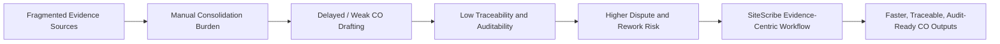

**Figure 1.** From fragmented evidence handling to evidence-centric CO operationalization.

---

## 2. Literature Review

### 2.1 Construction Change-Order Research Landscape

Change-order research consistently reports significant cost and schedule implications, especially when scope changes are poorly documented or late in decision cycles [54], [55], [56], [58]. Studies across different regions and project types indicate similar structural causes: incomplete information flow, communication fragmentation, revision volatility, and contractual ambiguity [53], [54], [57], [58].  

A central pattern in this literature is that the operational burden is not only the existence of change, but the lack of an evidence-centric process that converts field records into auditable contractual artifacts [53], [54], [55]. This supports the need for systems that explicitly connect evidence provenance to change-order output structure.

### 2.2 Digital Documentation and Evidence Traceability Gap

Project teams increasingly use digital tools, but data is still frequently distributed across non-integrated channels. In practice, this creates an “aggregation tax”: teams manually merge logs, files, and messages before drafting CO narratives.  

From a systems perspective, this indicates a missing layer between document repositories and decision artifacts: a workflow engine that can normalize evidence, preserve context, and produce traceable outputs. Existing process-heavy approaches often provide storage, but not operational synthesis into CO lifecycle states [53], [54], [58].

### 2.3 AI and Retrieval Literature Relevant to SiteScribe

Transformer-based modeling established scalable language representation and reasoning foundations [1], [2], [11]. Instruction alignment and modern LLM development enabled higher-quality operational assistance [3], [4].  

For evidence-grounded systems, retrieval-centric methods are particularly relevant. Retrieval-Augmented Generation (RAG) and dense retrieval methods provide grounded context injection and reduce purely parametric response dependence [5], [6]. Sentence-level embedding methods and vector search toolchains support practical semantic retrieval over project evidence corpora [7], [8].  

For multimodal construction contexts (e.g., site photos), vision-language methods are relevant to descriptive enrichment and contextual interpretation [9], [10].

### 2.4 Security and Governance Literature for Production Systems

Because CO workflows are legally and financially sensitive, governance must be treated as a first-class design concern. OWASP guidance and NIST references emphasize layered controls for identity, authorization, validation, abuse resistance, and secure configuration [13], [14], [15], [19], [20], [21].  

Protocol-level interoperability and secure integration behavior rely on established standards in HTTP semantics, JWT, HMAC, JSON, cookies, and TLS [23], [25], [26], [27], [29], [32]. These are directly relevant to webhook signatures, authenticated sessions, and secure export flows in systems like SiteScribe.

### 2.5 Reproducibility, DOI, and FAIR Publication Practice

To move beyond prototype claims, software artifacts should be versioned, archived, and citable. Zenodo DOI workflows provide persistent identifiers for versioned releases and concept-level project lineage [45], [46], [47], [48]. FAIR guidance supports long-term discovery, reuse, and metadata quality in technical dissemination [49], [50], [51], [52].  

For this reason, the present study is structured not only as a system description, but as a publication-ready engineering artifact model.

### 2.6 Synthesis and Identified Research Gap

The reviewed bodies of work establish strong independent foundations:

1. construction change-order impact and process challenges [53], [54], [55], [56], [57], [58],  
2. AI/retrieval methods for unstructured context [1], [5], [6], [7], [8],  
3. security and governance frameworks for production systems [13], [19], [20], [23], [32], and  
4. reproducibility/DOI standards [45], [49], [52].

However, there is a practical integration gap: limited end-to-end implementations that combine **evidence normalization + event triage + structured CO lifecycle + export integrity + multi-tenant governance + optional AI augmentation** in one cohesive operational platform.

SiteScribe is designed to directly address this gap.

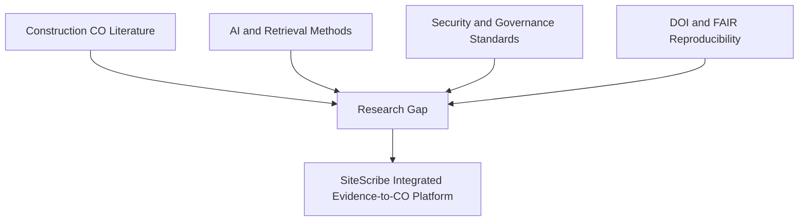

**Figure 2.** Literature streams converging into the identified research gap and SiteScribe positioning.

**Table 1. Comparative View of Literature Streams and SiteScribe Alignment**

| Literature Stream | What Prior Work Emphasizes | Remaining Gap | SiteScribe Alignment |
|---|---|---|---|
| Construction CO studies [53]-[58] | Causes/impacts of change orders, delays, and cost pressure | Limited implementation-level pipeline for evidence-to-CO traceability | End-to-end evidence-centric operational workflow |
| AI/LLM/RAG [1]-[12] | Context modeling, retrieval, generation, multimodal enrichment | Often lacks domain governance and contractual workflow constraints | Optional AI augmentation within governed workflow |
| Security/standards [13]-[32] | Identity, access, protocol and control baselines | Not construction workflow-specific by default | Multi-tenant RBAC, validation, secure integration model |
| DOI/FAIR ecosystem [45]-[52] | Persistent citation and metadata quality | Often disconnected from software workflow evaluation papers | DOI-oriented dissemination and reproducibility path |

---

## 3. Problem Formulation

### 3.1 Operational Setting

Let a construction project produce a time-ordered stream of heterogeneous evidence artifacts:

\\[
E = \\{e_1, e_2, \\dots, e_n\\}
\\]

Each evidence item \\(e_i\\) may include:
- structured metadata (type, timestamp, author, project scope),
- optional binary payload (PDF/image),
- optional extracted text representation.

The target output space is a set of change-order artifacts:

\\[
C = \\{c_1, c_2, \\dots, c_m\\}
\\]

where each \\(c_j\\) must be:
1. project-scoped and access-governed,  
2. evidence-linked and reviewable, and  
3. exportable in an integrity-verifiable package.

This formulation reflects the practical gap identified in Sections 1 and 2: evidence exists, but evidence-to-CO transformation is weakly operationalized [53], [54], [58].

### 3.2 Entity-Level Formal Definitions

For the purposes of this study:

- **Evidence item** \\(e_i\\): canonical project record with optional content and extracted representation.
- **Signal** \\(s_k\\): machine- or rule-derived indicator that an evidence item may imply scope/cost/schedule change.
- **Event** \\(v_l\\): triage unit grouping one or more signals for decision workflow.
- **Change Order** \\(c_j\\): structured contractual artifact derived from event context and evidence support.
- **Export package** \\(x_q\\): generated artifact bundle containing summary document, evidence attachments, and manifest integrity metadata.

Evidence-to-CO provenance relation:

\\[
\\mathcal{P}(c_j) \\subseteq E
\\]

meaning every CO should be traceable to a supporting evidence subset.

### 3.3 Objective Function

The platform objective is to minimize operational friction in evidence-to-CO conversion while preserving governance and integrity:

\\[
\\min \\; \\alpha L_{decision} + \\beta L_{traceability} + \\gamma R_{governance} + \\delta R_{integrity}
\\]

where:
- \\(L_{decision}\\): latency from relevant evidence availability to first usable CO draft,
- \\(L_{traceability}\\): traceability loss (missing/weak evidence linkage),
- \\(R_{governance}\\): risk of unauthorized or unscoped actions,
- \\(R_{integrity}\\): risk of unverifiable export artifact composition.

Weights \\(\\alpha,\\beta,\\gamma,\\delta\\) are context-dependent and organization-specific.

### 3.4 Constraints

The optimization target above is subject to the following hard constraints:

1. **Tenant isolation constraint**  
   Any mutation or retrieval action must be organization- and project-scoped [13], [19], [20].

2. **Role constraint**  
   Action \\(a\\) on resource \\(r\\) is allowed only if role \\(u_r\\) satisfies minimum policy threshold [14], [35].

3. **Validation constraint**  
   Inputs must pass type/size/identifier checks before persistence [15], [18].

4. **Integrity constraint**  
   Export package must include deterministic manifest fields and cryptographic digests [22].

5. **Availability constraint**  
   Core workflow must remain operational even when AI features are disabled or unavailable [5], [21].

### 3.5 System Boundary and Assumptions

#### In-scope
- evidence ingestion and transformation,
- signal/event workflow,
- CO drafting and editing lifecycle,
- governed export generation.

#### Out-of-scope
- legal adjudication of claim validity,
- automatic contract interpretation as binding legal advice,
- enterprise-scale distributed consensus across independent organizations.

#### Assumptions
- users are authenticated and membership-resolved,
- evidence timestamps are available or inferable,
- storage provider semantics are reliable at the object level,
- external delivery endpoints (email/webhook) are reachable when configured.

### 3.6 Failure Modes and Error Surface

Representative failure classes include:

1. malformed evidence uploads,
2. missing extracted text from low-quality PDFs,
3. false-positive/false-negative signal detection,
4. permission-denied transitions in role-constrained actions,
5. outbound delivery failure (email/webhook),
6. optional AI non-response.

The formulation requires graceful degradation: workflow correctness must not depend on AI completion or external delivery success [21], [23], [32].

### 3.7 Problem-to-Solution Mapping

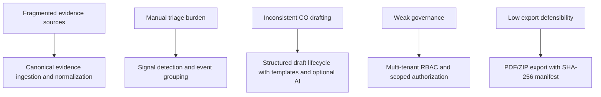

**Figure 3.** Core problem dimensions and corresponding SiteScribe solution mechanisms.

### 3.8 Measurable Formulation Outputs

To support later methodology and evaluation, the formulation yields the following measurable outputs:

| Output Variable | Description | Indicative Metric |
|---|---|---|
| \\(T_{draft}\\) | Time to first CO draft from relevant evidence | median hours |
| \\(Q_{trace}\\) | Evidence-link completeness in CO content | percentage linked sections |
| \\(G_{auth}\\) | Authorization correctness | blocked unauthorized action rate |
| \\(I_{export}\\) | Export integrity consistency | valid manifest verification rate |
| \\(R_{review}\\) | Review process efficiency | number of review cycles |

**Table 2.** Problem-formulation output variables and measurable indicators.

### 3.9 Transition to Methodology

Given this formalization, the methodology section will define:

1. how evidence is transformed into searchable and triage-ready representations,  
2. how deterministic and optional-AI decision layers are composed,  
3. how lifecycle governance is enforced at server-side boundaries, and  
4. how evaluation metrics map to the optimization objective defined above.

---

## 4. Requirements Engineering

### 4.1 Requirements Engineering Approach

The requirements model is derived from the problem formulation in Section 3 and from domain constraints observed in construction change-order workflows [53], [54], [58]. We use a layered requirements approach:

1. **Domain requirements** (construction evidence and CO lifecycle needs),  
2. **System requirements** (functional workflow capabilities),  
3. **Assurance requirements** (security, governance, and auditability), and  
4. **Operational requirements** (deployability, maintainability, and extensibility) [13], [19], [20], [33], [36].

This structure is intentionally traceability-oriented: each requirement must map to at least one module family and one validation strategy.

### 4.2 Stakeholder-Centered Requirement Sources

Requirements are elicited from the following stakeholder roles:

- **Project Manager (PM):** needs rapid triage, draft consistency, approval visibility.
- **Field/Documentation roles:** need low-friction evidence ingestion and retrieval.
- **Organization Owner/Admin:** needs governance, integrations, and audit confidence.
- **Review/Commercial stakeholders:** need defensible exports and evidence linkage.
- **Technical operators:** need secure deployment and predictable runtime behavior.

These actor needs align with both domain findings in change-order literature and production software governance practices [54], [56], [58], [14], [21].

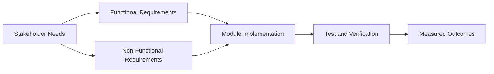

**Figure 4.** Requirements traceability flow from stakeholder needs to measurable outcomes.

### 4.3 Functional Requirements (FR)

The core functional requirements are defined below.

| ID | Functional Requirement | Rationale | Priority |
|---|---|---|---|
| FR-1 | The system shall support project-scoped evidence ingestion for PDF, image, and text-based records. | Evidence normalization is the entry point of all downstream logic. | Must |
| FR-2 | The system shall extract and persist textual representations and chunked segments when available. | Required for retrieval, triage context, and optional AI enrichment. | Must |
| FR-3 | The system shall detect potential change signals from evidence and create triageable events. | Reduces manual discovery burden for PM workflows. | Must |
| FR-4 | The system shall enable event-to-CO draft generation via template and optional AI-assisted paths. | Standardizes draft creation and accelerates drafting cycle. | Must |
| FR-5 | The system shall provide structured CO editing (scope, clauses, assumptions, line items, status). | Supports contractual completeness and revision control. | Must |
| FR-6 | The system shall support collaboration artifacts (comments, review signals, notifications). | Improves communication continuity during review cycles. | Should |
| FR-7 | The system shall generate export artifacts (PDF + ZIP + manifest) with deterministic metadata. | Required for defensibility and package integrity verification. | Must |
| FR-8 | The system shall support scheduled export execution and configurable delivery endpoints. | Supports recurring reporting and operational automation. | Should |
| FR-9 | The system shall provide lexical and semantic search over project evidence and CO records. | Enables rapid retrieval in high-volume evidence contexts. | Should |
| FR-10 | The system shall support org/project collaboration features (invites, role assignment, webhook management). | Needed for multi-tenant team operations. | Must |

**Table 3.** Functional requirements set for SiteScribe.

### 4.4 Non-Functional Requirements (NFR)

| ID | Non-Functional Requirement | Design Target | Priority |
|---|---|---|---|
| NFR-1 | Security | Enforce authentication, authorization, validation, and secure headers. | Must |
| NFR-2 | Tenant Isolation | Prevent cross-organization and cross-project data leakage. | Must |
| NFR-3 | Traceability | Ensure evidence-to-CO provenance and auditable lifecycle transitions. | Must |
| NFR-4 | Integrity | Provide hash-verifiable export manifests for generated packages. | Must |
| NFR-5 | Availability | Maintain deterministic core workflow when AI services are unavailable. | Must |
| NFR-6 | Maintainability | Modular architecture with clear domain/integration boundaries. | Should |
| NFR-7 | Extensibility | Support incremental feature growth (integrations, metrics, policy). | Should |
| NFR-8 | Usability | Keep operational workflows understandable for mixed technical roles. | Should |
| NFR-9 | Reproducibility | Support release/version archiving and DOI-oriented publication workflow. | Should |

**Table 4.** Non-functional requirements and quality attributes.

### 4.5 Requirement-to-Constraint Mapping

Requirements inherit hard constraints from Section 3:

- **Governance constraints:** FR-1 to FR-10 must execute under role and scope checks [14], [19], [20].  
- **Validation constraints:** FR-1/FR-2 require strict input controls [15], [18].  
- **Integrity constraints:** FR-7/FR-8 enforce hash-based manifest generation [22].  
- **Protocol constraints:** integration operations in FR-8/FR-10 rely on secure HTTP, JSON, and signing semantics [23], [26], [27], [32].

### 4.6 Requirement Prioritization Strategy

Prioritization follows an operational risk model:

1. **Must:** foundational workflow and governance controls (FR-1..5, FR-7, FR-10, NFR-1..5).  
2. **Should:** retrieval enhancement, collaboration enrichments, extensibility controls (FR-6, FR-8, FR-9, NFR-6..9).  
3. **Could (future):** advanced domain intelligence, richer compliance and benchmarking features.

This approach keeps the minimum viable research system aligned with safety and traceability first, then optimization layers.

### 4.7 Acceptance Criteria and Verification Hooks

Each critical requirement category is linked to a verification hook:

| Requirement Area | Acceptance Condition | Verification Hook |
|---|---|---|
| Evidence ingestion | Invalid MIME/oversize payloads are rejected; valid payloads persist successfully. | Input validation tests + action-level checks |
| Event triage | Detection run produces event/signal output for qualifying evidence windows. | Detection unit tests + integration checks |
| CO lifecycle | Draft can be created, updated, and status-managed with role policy enforcement. | Server action tests + role-path verification |
| Export integrity | Manifest includes deterministic metadata and hash fields for package artifacts. | Manifest/hash tests |
| Access governance | Unauthorized actions are blocked across project/org boundaries. | Authorization path tests |

**Table 5.** Acceptance and validation mapping for key requirement clusters.

### 4.8 Risks in Requirements Interpretation

Potential requirement risks include:

1. domain variability across contract forms,  
2. ambiguity in what constitutes “sufficient” evidence linkage,  
3. organization-specific review semantics not captured in generic workflow states, and  
4. over-reliance on optional AI outputs in user expectations.

Mitigation strategy: preserve deterministic baseline behavior and explicitly separate “required workflow output” from “optional AI enhancement” [5], [21].

### 4.9 Transition to Methodology and Architecture Sections

This requirements baseline provides the bridge to methodology and architecture:

- FR/NFR sets define what must be implemented,  
- constraints define what must never be violated, and  
- acceptance conditions define what must be demonstrably verifiable.

Accordingly, the next sections operationalize these requirements through architecture, pipeline design, and evaluation protocols.

### 4.10 Consolidated Post-Requirements Section Plan

To avoid excessive top-level fragmentation, all sections after Requirements Engineering will be grouped under the following main sections:

1. **Section 5: System Design and Implementation**  
   5.1 Methodology Overview  
   5.2 Logical Architecture  
   5.3 Data Model and Multi-Tenancy  
   5.4 Core Pipeline (Evidence -> Signals -> Events -> CO -> Export)  
   5.5 AI Augmentation Layer (Optional)  
   5.6 Collaboration and Integration Features

2. **Section 6: Security, Governance, and Reliability**  
   6.1 Authentication and Authorization  
   6.2 Validation, Integrity, and Secure Configuration  
   6.3 Threat Model and Control Mapping  
   6.4 Operational Reliability and Failure Handling

3. **Section 7: Evaluation and Discussion**  
   7.1 Evaluation Framework and Metrics  
   7.2 Validation Strategy  
   7.3 Threats to Validity  
   7.4 Limitations and Future Work

4. **Section 8: Reproducibility and DOI Publication Strategy**  
   8.1 Reproducibility Checklist  
   8.2 Zenodo and DOI Workflow  
   8.3 FAIR Metadata and Citation Practice

5. **Section 9: Conclusion**  
   9.1 Summary of Contributions  
   9.2 Practical Implications  
   9.3 Closing Remarks

---

## 5. System Design and Implementation

### 5.1 Methodology Overview

SiteScribe is implemented as an evidence-centric workflow system where each stage produces a structured state transition consumable by the next stage. The implementation methodology follows a layered engineering approach:

1. **Normalize** heterogeneous project evidence into canonical records.  
2. **Detect** potential change signals from evidence and group them into triage events.  
3. **Draft** structured change orders from event context (template-based, optionally AI-enriched).  
4. **Govern** edits and status transitions with role-constrained server-side actions.  
5. **Package** outputs into integrity-verifiable exports (PDF+ZIP+manifest).  

This methodology is aligned with retrieval-grounded AI workflows [5], [6], operational software modularity [33], [36], and secure system constraints [13], [19], [20].

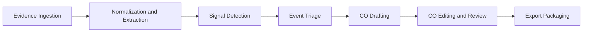

**Figure 5.** Methodological workflow of SiteScribe from evidence to export.

### 5.2 Logical Architecture

The platform follows a full-stack modular architecture implemented with Next.js App Router and server actions [33], credential/session middleware through Auth.js/NextAuth [34], [35], and a Prisma-MySQL persistence layer [36], [37].  

Core architectural decisions:

- business-critical authorization checks are executed server-side,  
- UI components are non-authoritative and consume action results,  
- domain logic is organized in dedicated service modules (`lib/*`),  
- infrastructure adapters (storage/email/webhooks/AI) are isolated for replaceability.

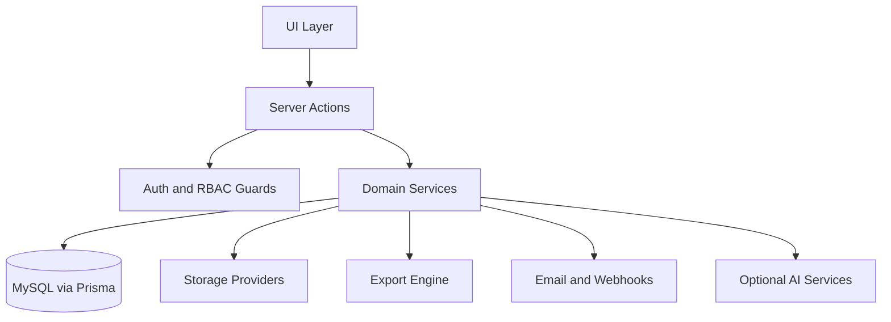

**Figure 6.** Logical architecture and integration boundaries.

### 5.3 Data Model and Multi-Tenancy

SiteScribe uses organization-first tenancy. Projects are nested within organizations, and all operational records (evidence, events, COs, exports) are project-scoped.  

Role governance follows a strict order: VIEWER < SUBCONTRACTOR < FIELD < PM < OWNER.  

This model supports:
- tenant isolation,
- policy-consistent mutations,
- auditable lifecycle actions.

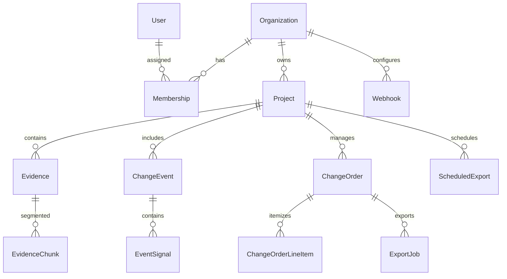

**Figure 7.** Core domain entities and multi-tenant data relationships.

### 5.4 Core Pipeline Implementation

#### 5.4.1 Evidence Ingestion and Preprocessing

Evidence upload actions validate file type, size, and textual fields before persistence. PDF content may be extracted and chunked for retrieval use. File hash metadata is computed for export integrity [22].  

#### 5.4.2 Signal Detection and Event Creation

A rule-driven detector scans recent evidence for type priors and textual patterns, then persists event signals and event groups for triage. Optional AI enrichment can refine score/reason/type attributes [5], [21].  

#### 5.4.3 Change Order Draft Lifecycle

From a selected event, the system generates a structured CO draft that can be iteratively edited (title, narrative, clauses, assumptions, exclusions, line items, status). Comment and approval-related actions support collaborative governance.

#### 5.4.4 Export and Delivery

Export generation composes:
- summary PDF,
- evidence ZIP,
- manifest JSON with deterministic metadata and SHA-256 values.

This package can be downloaded directly, sent by email, or executed via scheduled export jobs.

**Table 6. Module-to-Workflow Mapping in Section 5**

| Workflow Stage | Representative Implementation Modules | Primary Output |
|---|---|---|
| Ingestion | `app/actions/evidence.ts`, `lib/storage.ts`, `lib/validation.ts` | canonical evidence record |
| Extraction/Chunking | `lib/pdf-extract.ts`, `EvidenceChunk` persistence | retrieval-ready text chunks |
| Detection/Triage | `app/actions/signals.ts`, `lib/detect-signals.ts` | events and event signals |
| CO Lifecycle | `app/actions/change-order.ts`, `lib/co-draft.ts` | structured CO artifact |
| Export | `app/actions/export.ts`, `lib/export-package.ts`, `lib/export-job.ts` | PDF+ZIP+manifest package |
| Governance/Audit | `lib/auth-server.ts`, `lib/rbac.ts`, `lib/audit.ts` | policy-compliant, auditable transitions |

### 5.5 AI Augmentation Layer (Optional)

AI in SiteScribe is intentionally optional. If disabled, the deterministic core workflow remains fully operational. If enabled, AI assists with:

- evidence summarization,
- evidence type suggestion,
- semantic search embeddings,
- signal enrichment,
- CO narrative enrichment,
- photo description.

This design follows a “bounded augmentation” principle: AI improves speed and context quality but does not replace policy-critical controls or deterministic export behavior [5], [7], [21].

### 5.6 Collaboration and Integration Features

Beyond the core evidence-to-CO flow, SiteScribe includes operational collaboration and integration modules:

- in-app notifications for workflow events,
- webhook delivery for external automation,
- role-aware invitation and membership management,
- friend-based 1:1 messaging for team coordination.

These features are implemented as supporting layers that improve operational continuity without changing the core decision provenance model.

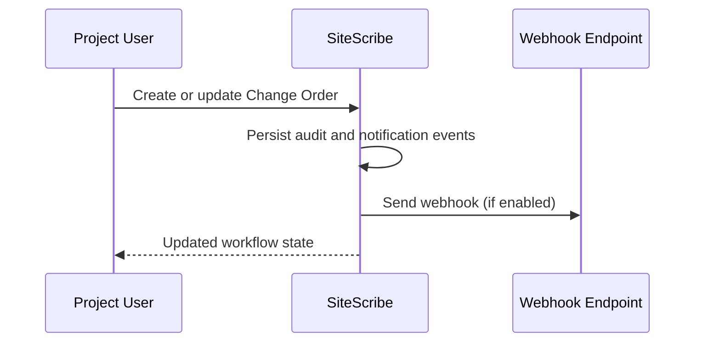

**Figure 8.** Collaboration/integration event flow after core workflow actions.

---

## 6. Security, Governance, and Reliability

### 6.1 Security-by-Design Principles

SiteScribe applies a defense-in-depth model where security controls are distributed across identity, authorization, input handling, transport policy, and operational endpoint protection [13], [14], [19], [20].  

The guiding principles are:

1. **Server-authoritative enforcement** for all policy-critical actions.  
2. **Least-privilege execution** through role thresholds and project/org scoping.  
3. **Validation-first processing** for all external inputs.  
4. **Integrity-preserving outputs** for exportable contractual artifacts.  
5. **Graceful degradation** under optional component failure (e.g., AI/outbound services).

### 6.2 Authentication and Session Governance

Authentication is credential-based and mediated through server-side session checks. Session identity is not treated as sufficient authorization by itself; all mutation-sensitive operations must pass role and scope checks before execution [34], [35], [19].  

Key governance points:

- authenticated access for protected operational routes,  
- session-to-user resolution for action ownership,  
- production secret requirements and secure cookie posture,  
- bounded session lifecycle assumptions.

These controls reduce impersonation and unauthorized action risk at the application boundary [13], [19].

### 6.3 Authorization and Multi-Tenant Isolation

SiteScribe enforces tenant boundaries via organization/project-scoped guards.  
Authorization decisions are evaluated against:

1. organization membership,  
2. project ownership lineage,  
3. minimum required role for action class.

Role ordering (VIEWER < SUBCONTRACTOR < FIELD < PM < OWNER) is applied consistently to evidence upload, signal triage, CO editing, and administrative operations.

This design addresses cross-tenant leakage and privilege escalation risks common in multi-tenant SaaS systems [14], [20], [21].

### 6.4 Input Validation, Sanitization, and Safe Linking

All externally provided values are validated or normalized before persistence and query execution.  
Controls include:

- identifier shape checks,  
- type and length constraints,  
- URL validation and protocol restrictions,  
- notification link sanitization to internal-path model.

For evidence uploads, MIME allowlists and size caps mitigate unsafe payload classes and reduce attack surface [15], [18].  

This layered validation approach aligns with OWASP validation and injection-defense guidance [15], [18].

### 6.5 Transport, Header Policy, and Endpoint Hardening

Security headers (including CSP and related browser controls) are enforced at framework level to reduce client-side attack vectors [17], [23].  

Protocol behavior follows stable RFC semantics for request/response handling, token serialization, and payload formats [23], [25], [27], [29], [32].  

Scheduled export endpoints are protected with shared-secret checks and timing-safe comparison logic to mitigate trivial timing side channels [26].

### 6.6 Integrity and Auditability Guarantees

For CO exports, SiteScribe generates deterministic package metadata:

- file-level manifest entries,  
- SHA-256 digests,  
- artifact identifiers and timestamps.

Audit logging records key lifecycle actions such as create/update/status transitions, enabling retrospective accountability and workflow inspection.

Together, export integrity and audit logs improve defensibility in documentation-heavy contractual contexts [22], [53], [58].

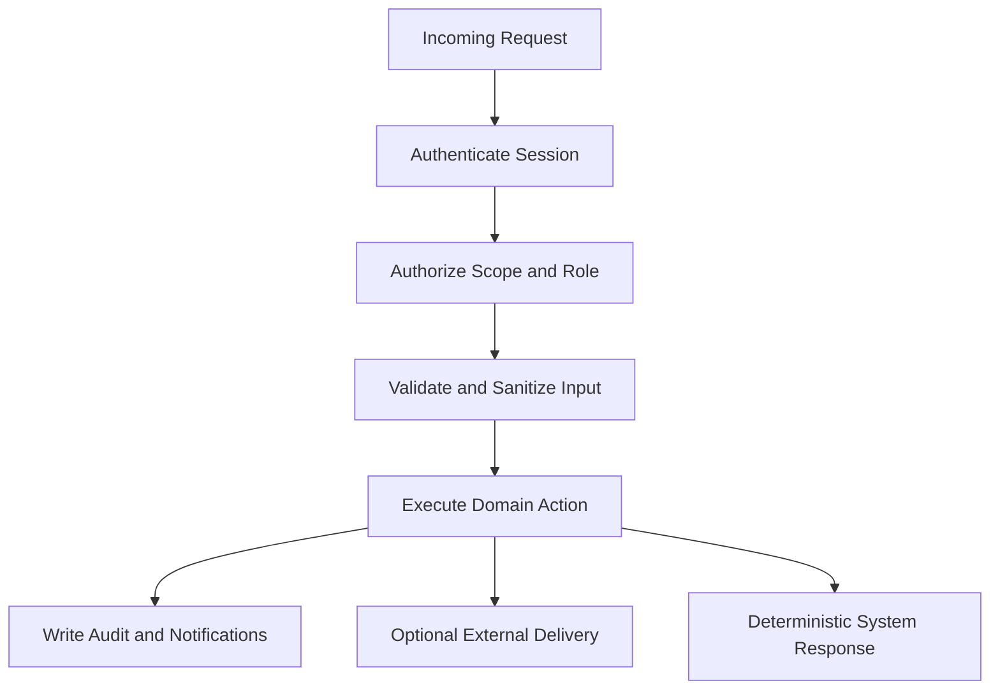

**Figure 9.** Security and governance control flow for server-side operations.

### 6.7 Reliability Model and Failure Handling

Reliability is treated as controlled continuity under partial failure.  
Representative failure classes and response posture:

1. **AI service unavailable:** continue deterministic workflow without AI enrichment.  
2. **Email/webhook failure:** preserve primary transaction state, surface delivery status separately.  
3. **Extraction limitations (e.g., poor PDF text):** retain evidence artifact and metadata even if text quality is low.  
4. **Permission-denied action:** return explicit non-success without side-effect persistence.  
5. **Invalid input:** reject before domain mutation.

This model ensures core system correctness does not depend on optional integrations.

### 6.8 Security and Reliability Control Mapping

| Control Area | Mechanism in SiteScribe | Security/Reliability Goal | Reference Basis |
|---|---|---|---|
| Authentication | server-side session checks | authenticated action boundary | [19], [34], [35] |
| Authorization | org/project + role guards | tenant isolation and least privilege | [14], [20] |
| Input safety | validation/sanitization utilities | reject malformed or unsafe inputs | [15], [18] |
| Transport/browser hardening | CSP and related headers | reduce client-side exploitability | [17], [23] |
| Endpoint protection | secret-gated scheduled route | protect automated execution path | [26], [32] |
| Integrity assurance | SHA-256 manifest exports | verifiable artifact consistency | [22] |
| Accountability | audit log persistence | non-repudiable workflow history | [20], [53] |
| Degraded-mode reliability | optional AI/integration fallback | continuity under partial service loss | [21] |

**Table 7.** Security and reliability control mapping for SiteScribe.

### 6.9 Transition to Evaluation and Discussion

Section 6 establishes that SiteScribe’s workflow is governed by policy-constrained server actions with explicit integrity and fallback behavior.  
The next section operationalizes these guarantees into measurable evaluation dimensions, including latency, traceability quality, authorization correctness, and export verification outcomes.

---

## 7. Evaluation and Discussion

### 7.1 Evaluation Objectives

The evaluation objective is to determine whether SiteScribe improves the evidence-to-CO lifecycle on four principal dimensions:

1. **Workflow efficiency** (time-to-draft, time-to-review decision),
2. **Traceability quality** (evidence linkage completeness),
3. **Governance correctness** (authorization boundary behavior),
4. **Artifact reliability** (export integrity and delivery robustness).

These dimensions are directly derived from the optimization variables introduced in Section 3 and the requirement constraints defined in Section 4.

### 7.2 Evaluation Questions

The evaluation is structured around the following questions:

- **RQ1:** Does SiteScribe reduce the time required to produce a first usable CO draft after relevant evidence becomes available?  
- **RQ2:** Does SiteScribe improve evidence-to-CO traceability compared to manual aggregation workflows?  
- **RQ3:** Are role and tenant boundaries consistently enforced across workflow-critical actions?  
- **RQ4:** Are generated export packages verifiable and operationally reproducible?  
- **RQ5:** Does optional AI augmentation improve retrieval and drafting utility without degrading deterministic workflow stability?

### 7.3 Experimental Design

A practical comparative design is recommended:

1. **Baseline arm:** existing/manual evidence-to-CO process used by project team.
2. **Treatment arm:** SiteScribe-assisted process with identical project context.
3. **Sampling unit:** project-week or event-to-CO case.
4. **Observation horizon:** minimum 6 weeks to reduce onboarding bias.

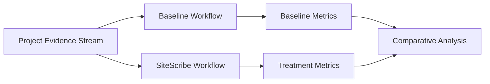

**Figure 10.** Comparative evaluation design: baseline versus SiteScribe-assisted workflow.

### 7.4 Evaluation Metrics

| Metric ID | Metric Name | Definition | Unit | Primary RQ |
|---|---|---|---|---|
| M1 | Time-to-First-Draft | Duration from first relevant evidence to first CO draft creation | hours | RQ1 |
| M2 | Review Cycle Count | Number of revision loops before approval/rejection | count | RQ1 |
| M3 | Traceability Coverage | Ratio of CO sections with explicit evidence backing | % | RQ2 |
| M4 | Authorization Correctness | Unauthorized actions correctly blocked | % | RQ3 |
| M5 | Export Integrity Pass Rate | Export packages with valid manifest hash checks | % | RQ4 |
| M6 | Delivery Reliability | Successful outbound delivery over total attempts | % | RQ4 |
| M7 | Search Effectiveness | Precision@k for evidence retrieval tasks | score | RQ5 |
| M8 | AI Dependency Stability | Core workflow completion rate when AI disabled/unavailable | % | RQ5 |

**Table 8.** Core evaluation metrics and research-question mapping.

### 7.5 Measurement Protocol

#### 7.5.1 Instrumentation Sources

Data collection should combine:
- workflow timestamps from persisted records,
- audit logs for action chronology,
- export metadata and hash verification checks,
- authorization outcomes from action responses,
- retrieval task annotations for Precision@k.

#### 7.5.2 Data Collection Windows

To mitigate volatility:
- use weekly aggregation windows,
- separate onboarding phase from steady-state phase,
- report both median and interquartile range for duration metrics.

#### 7.5.3 Statistical Strategy

Recommended analysis:
- non-parametric comparison for skewed temporal variables,
- effect-size reporting alongside significance testing,
- confidence intervals for primary metrics,
- stratified analysis by role class and project complexity.

### 7.6 Validation Strategy

Evaluation validity should be supported by multi-layer verification:

1. **Unit-level validation:** RBAC logic, signal scoring behavior, manifest/hash generation, input validation routines.
2. **Action-level validation:** project-scoped mutation and retrieval behavior.
3. **Scenario validation:** end-to-end workflows from evidence upload to export generation.
4. **Resilience validation:** behavior under AI unavailability and outbound delivery failure.

This strategy aligns with secure software assurance practice and helps separate functional correctness from integration volatility [14], [20], [21].

### 7.7 Expected Outcome Pattern

Based on architecture and control design, expected directional outcomes are:

- reduced median time-to-first-draft (M1),
- improved traceability coverage (M3),
- high authorization correctness (M4 approaching ceiling),
- stable manifest verification rate (M5 near deterministic),
- stable completion under degraded AI conditions (M8).

These expectations are engineering hypotheses, not final empirical claims, until measured under controlled field conditions.

### 7.8 Threats to Validity

#### 7.8.1 Internal Validity

Early productivity gains may reflect novelty/onboarding effects rather than sustained process improvements.

#### 7.8.2 External Validity

Results may vary by contract regime, project type, and organizational maturity.

#### 7.8.3 Construct Validity

Traceability quality can be interpreted subjectively without pre-defined annotation criteria.

#### 7.8.4 Conclusion Validity

Small sample sizes and heterogeneous projects can inflate uncertainty if not stratified.

### 7.9 Discussion

The main implication of this evaluation framework is that SiteScribe should be assessed as a **workflow system**, not only as a software feature set.  
The platform’s value emerges from coordinated behavior across ingestion, governance, drafting, and export integrity, rather than isolated module performance. In this sense, strong security and reliability controls (Section 6) are not auxiliary; they are part of the measurable productivity and defensibility outcome.

A second implication is that optional AI should be judged on **marginal utility** (retrieval quality, drafting assistance) while deterministic workflow completion remains the non-negotiable baseline. This separation prevents over-attribution of system success to model output quality alone [5], [7], [21].

### 7.10 Transition to Reproducibility and DOI Publication

With evaluation objectives, metrics, and validity boundaries defined, the next section establishes reproducibility mechanisms and DOI-oriented publication workflow to support transparent dissemination and citable artifact release [45], [49], [52].

## 8. Reproducibility and DOI Publication Strategy

### 8.1 Rationale and Objectives

A construction intelligence platform intended for contractual and operational use should not be evaluated only by software behavior; it should also be published as a reproducible research artifact. Reproducibility increases technical trust, allows independent verification, and improves scholarly and industrial reuse [45], [49], [50], [52].

For SiteScribe, reproducibility objectives are defined as follows:

1. preserve a citable, immutable record of each release;
2. make implementation and documentation discoverable through persistent identifiers;
3. expose enough metadata for third-party interpretation and partial replication;
4. separate stable baseline workflow behavior from optional AI-enhanced behavior.

These objectives align with FAIR-oriented dissemination practices and DOI-based software archiving standards [46], [47], [48], [49], [51].

### 8.2 Reproducibility Scope Definition

The reproducibility scope is intentionally explicit to avoid over-claiming:

- **In-scope reproducibility:** architecture, data model, API/feature behavior, security controls, deterministic export logic, deployment instructions, and evaluation protocol templates.
- **Conditionally reproducible components:** AI-assisted retrieval and drafting quality, which may vary by model version, provider availability, and inference configuration [5], [7], [11].
- **Out-of-scope full replication:** proprietary project data and organization-specific legal workflows.

This scoped model follows realistic reproducibility guidance in software-oriented publications where operational constraints and data confidentiality coexist [49], [50], [52].

### 8.3 Artifact Package Specification

Each archival release should include a structured artifact package:

| Artifact ID | Component | Purpose | Reproducibility Role |
|---|---|---|---|
| A1 | Source code snapshot | Frozen implementation state | Enables code-level verification |
| A2 | Versioned README and architecture notes | System orientation and setup semantics | Reduces setup ambiguity |
| A3 | Environment/dependency manifest | Runtime consistency | Minimizes configuration drift |
| A4 | API and data schema documentation | Interface and model constraints | Supports independent integration tests |
| A5 | Security and governance policy notes | Control rationale and operational boundaries | Enables assurance review |
| A6 | Evaluation protocol template | Metric definitions and procedures | Supports method-level comparison |
| A7 | Release changelog | Version-to-version traceability | Preserves evolution history |
| A8 | Citation metadata (`CITATION.cff`) | Scholarly citation guidance | Standardizes citation behavior |

**Table 9.** Required archival artifact package for SiteScribe reproducibility.

### 8.4 Versioning and Release Discipline

Reproducibility depends on disciplined release boundaries. A release candidate should be frozen only after:

1. mandatory tests pass for critical pathways;
2. migration and schema consistency checks are complete;
3. security header/session policy checks are verified;
4. documentation reflects the exact shipped feature state.

A semantic versioning policy is recommended to encode backward compatibility expectations and reduce interpretive ambiguity for downstream users [33], [36], [45].

### 8.5 Zenodo DOI Workflow

Zenodo-based publication should follow a deterministic sequence:

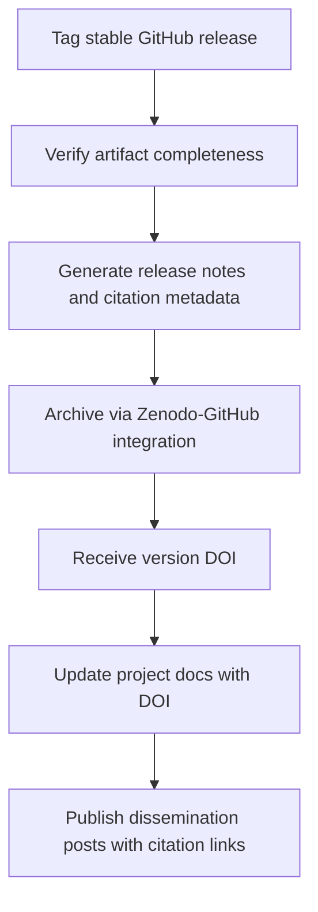

**Figure 11.** DOI-oriented archival and dissemination workflow using GitHub release and Zenodo integration.

This pattern produces both **version-level DOI** (specific release citation) and **concept-level DOI** (project lineage), improving long-term traceability and discoverability [45], [46], [47], [48].

### 8.6 Metadata and Documentation Minimums

To satisfy citation and reuse quality, each DOI release should include:

- title, authorship, affiliation, and contact metadata;
- abstract-level project description;
- keyword set aligned with domain and method;
- license declaration and reuse constraints;
- software dependencies and minimum runtime requirements;
- known limitations and reproducibility caveats;
- recommended citation format.

These metadata items map to FAIR discoverability and interoperability principles [49], [50], [51], [52].

### 8.7 Reproducible Evaluation Protocol Packaging

Because real construction data may be sensitive, evaluation reproducibility should be documented through protocol artifacts rather than raw data disclosure:

1. metric definitions with formal formulas;
2. event logging schema and timestamp standards;
3. anonymized example records and synthetic test cases;
4. analysis scripts or pseudo-procedures for aggregation;
5. validity threat checklist and interpretation boundaries.

This approach allows method replication while preserving confidentiality constraints.

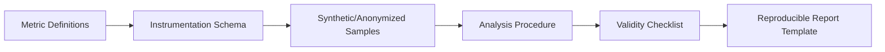

**Figure 12.** Protocol-centric reproducibility pipeline for evaluation without exposing sensitive project datasets.

### 8.8 Integrity, Compliance, and Risk Controls in Publication

Publication itself introduces governance concerns. The release process should enforce:

- exclusion of secrets, credentials, and environment-sensitive keys;
- removal or redaction of tenant-identifying fields;
- verification of dependency provenance and locked versions;
- consistency checks between documented and implemented security behavior.

These controls align with secure software lifecycle guidance and reduce accidental disclosure risks during open dissemination [13], [14], [20], [21].

### 8.9 Integration with Scholarly and Professional Communication

After DOI issuance, dissemination should be synchronized across technical and professional channels:

- repository README badge and citation section;
- academic manuscript reference update (DOI insertion);
- professional summary posts (e.g., LinkedIn and Medium) with reproducibility statement;
- changelog mapping from prior release to DOI-tagged release.

This synchronization prevents fragmentation between implementation reality and public narrative.

### 8.10 Reproducibility Readiness Checklist

| Checkpoint | Pass Criteria | Evidence |
|---|---|---|
| Code freeze status | Tagged release exists and maps to documented version | Git tag + release page |
| Artifact completeness | A1-A8 package present | Release assets and repository files |
| Metadata quality | Citation, license, authorship, keywords present | Zenodo metadata form + repo docs |
| Security hygiene | No secrets/PII in assets | Secret scan and manual audit logs |
| Evaluation reproducibility | Protocol template and metric formulas published | Evaluation appendix/package |
| DOI traceability | Version DOI and concept DOI recorded | Zenodo landing pages |

**Table 10.** Pre-publication reproducibility readiness checklist.

### 8.11 Limitations and Practical Constraints

Despite strong archival practice, several constraints remain:

- external API/model ecosystem changes can affect optional AI behavior over time [3], [4], [11];
- environment-level drift (OS, package ecosystem, infrastructure) can degrade exact replayability;
- contractual and privacy restrictions limit raw data publication;
- long-term dependency deprecation may require maintenance releases.

Therefore, reproducibility should be interpreted as **engineering-level transparency and method repeatability**, not strict bit-identical replication across all future contexts.

### 8.12 Section Summary and Transition

Section 8 establishes a publication-grade reproducibility strategy for SiteScribe by defining scope, artifact requirements, DOI workflow, metadata baselines, and governance controls. The resulting framework enables citable dissemination while preserving legal and operational boundaries in construction contexts [45], [49], [52].

With architecture, controls, evaluation, and reproducibility strategy now formalized, the next section can consolidate conclusions, contributions, limitations, and future research directions.

## 9. Conclusion and Future Work

### 9.1 Conclusion

This study introduced SiteScribe as an evidence-centric, multi-tenant change-order intelligence platform designed for construction environments where documentation fragmentation, delayed decision cycles, and weak traceability frequently increase contractual and operational risk [53], [54], [58].

The paper developed a full engineering narrative from context and gap definition (Sections 1-2), formal problem modeling (Section 3), requirements derivation (Section 4), architecture and implementation strategy (Section 5), security and reliability controls (Section 6), evaluation framework (Section 7), and reproducibility/DOI publication discipline (Section 8).

The central conclusion is that robust change-order support requires a coordinated system that combines:

1. deterministic workflow execution,
2. strict organization/project scoping and role governance,
3. evidence-to-output traceability,
4. integrity-preserving export semantics, and
5. optional AI augmentation that never replaces core operational correctness.

By treating AI as an assistive layer rather than a hard dependency, SiteScribe preserves continuity under model or provider variability while still benefiting from retrieval-grounded contextual assistance [5], [7], [21].

### 9.2 Consolidated Contributions

From an academic-engineering perspective, the work contributes:

1. **A domain-grounded problem formalization** for evidence-to-change-order transformation under multi-tenant constraints.
2. **A requirement-to-architecture traceability chain** connecting stakeholder needs to measurable system behaviors.
3. **A secure-by-design implementation posture** integrating RBAC, validation gates, scoped mutations, signed/traceable export pathways, and auditability controls [13], [14], [19], [20].
4. **An evaluation design framework** that measures workflow impact (time, traceability, authorization correctness, resilience) rather than isolated component outputs.
5. **A reproducibility and DOI publication model** aligned with FAIR and software citation best practices [45], [49], [52].

These contributions are intended to reduce the gap between prototype-level AI tooling and production-grade contract-support systems.

### 9.3 Practical Implications

For practice, the findings imply that organizations should prioritize evidence governance and workflow determinism before scaling advanced AI features. In operational settings, the most valuable improvements typically arise from consistent evidence capture, policy-correct access behavior, and defensible export generation.

In this framing, AI-assisted drafting and semantic retrieval provide acceleration and contextual enrichment, but legal and contractual confidence comes primarily from traceability completeness and integrity guarantees.

### 9.4 Limitations

Despite its comprehensive design, several limitations remain:

- field-level outcomes can vary by organizational maturity, contract regime, and documentation discipline;
- optional AI behavior may drift with model updates and provider-side changes [3], [4], [11];
- confidentiality constraints may limit publication of raw project datasets;
- integration ecosystem volatility (external APIs, document formats, delivery channels) can affect long-term interoperability.

Accordingly, the presented evaluation claims should be interpreted as a structured framework and engineering expectation set until validated across broader real-world deployments.

### 9.5 Future Work

Future work should focus on both empirical expansion and technical refinement:

1. **Longitudinal field studies** across multiple project types and jurisdictions to quantify sustained impact.
2. **Causal analysis extensions** to distinguish process effects from onboarding or novelty effects.
3. **Advanced multimodal evidence understanding** for richer image-document cross-referencing [9], [10].
4. **Policy-aware explanation interfaces** that improve auditor and manager trust in system-generated suggestions.
5. **Automated compliance templates** for contract-specific export structures and regional governance regimes.
6. **Benchmark datasets and open protocol suites** that improve comparability of construction intelligence systems while preserving privacy.

### 9.6 Final Remarks

SiteScribe demonstrates that modern construction intelligence systems can be designed as accountable workflow platforms rather than isolated AI utilities. The architecture and publication strategy presented in this paper establish a path toward citable, reproducible, and operationally credible deployment in document-intensive construction decision environments.

The next stage is comprehensive empirical execution with DOI-linked release cycles, enabling stronger evidence for adoption decisions in both academia and industry.

## References

[1] T. B. Brown et al., "Language Models are Few-Shot Learners," in *Advances in Neural Information Processing Systems (NeurIPS)*, 2020. [Online]. Available: https://papers.nips.cc/paper/2020/hash/1457c0d6bfcb4967418bfb8ac142f64a-Abstract.html

[2] L. Ouyang et al., "Training language models to follow instructions with human feedback," in *Advances in Neural Information Processing Systems (NeurIPS)*, 2022. [Online]. Available: https://arxiv.org/abs/2203.02155

[3] A. Chowdhery et al., "PaLM: Scaling Language Modeling with Pathways," 2022. [Online]. Available: https://arxiv.org/abs/2204.02311

[4] OpenAI, "GPT-4 Technical Report," 2023. [Online]. Available: https://arxiv.org/abs/2303.08774

[5] P. Lewis et al., "Retrieval-Augmented Generation for Knowledge-Intensive NLP Tasks," in *Advances in Neural Information Processing Systems (NeurIPS)*, 2020. [Online]. Available: https://arxiv.org/abs/2005.11401

[6] Y. Gao et al., "Retrieval-Augmented Generation for Large Language Models: A Survey," 2023. [Online]. Available: https://arxiv.org/abs/2312.10997

[7] G. Izacard et al., "Unsupervised Dense Information Retrieval with Contrastive Learning," 2021. [Online]. Available: https://arxiv.org/abs/2112.09118

[8] H. Su et al., "Instructor Embedding: One Embedder, Any Task," 2022. [Online]. Available: https://arxiv.org/abs/2212.09741

[9] A. Radford et al., "Learning Transferable Visual Models From Natural Language Supervision," in *Proc. ICML*, 2021. [Online]. Available: https://arxiv.org/abs/2103.00020

[10] J. Li et al., "BLIP-2: Bootstrapping Language-Image Pre-training with Frozen Image Encoders and Large Language Models," 2023. [Online]. Available: https://arxiv.org/abs/2301.12597

[11] H. Touvron et al., "Llama 2: Open Foundation and Fine-Tuned Chat Models," 2023. [Online]. Available: https://arxiv.org/abs/2307.09288

[12] Google DeepMind, "Gemini: A Family of Highly Capable Multimodal Models," 2023. [Online]. Available: https://arxiv.org/abs/2312.11805

[13] OWASP Foundation, "OWASP Top 10:2021," 2021. [Online]. Available: https://owasp.org/www-project-top-ten/

[14] NIST, "Security and Privacy Controls for Information Systems and Organizations (SP 800-53 Rev. 5)," 2020. [Online]. Available: https://csrc.nist.gov/publications/detail/sp/800-53/rev-5/final

[15] OWASP Foundation, "OWASP API Security Top 10 (2023)," 2023. [Online]. Available: https://owasp.org/API-Security/editions/2023/en/0x11-t10/

[16] OWASP Foundation, "Application Security Verification Standard (ASVS)," 2021. [Online]. Available: https://owasp.org/www-project-application-security-verification-standard/

[17] OWASP Foundation, "Software Assurance Maturity Model (SAMM) v2.1," 2020. [Online]. Available: https://owaspsamm.org/model/

[18] OWASP Foundation, "OWASP Top 10 for LLM Applications 2025," 2025. [Online]. Available: https://genai.owasp.org/resource/owasp-top-10-for-llm-applications-2025/

[19] NIST, "Zero Trust Architecture (SP 800-207)," 2020. [Online]. Available: https://csrc.nist.gov/publications/detail/sp/800-207/final

[20] NIST, "Secure Software Development Framework (SP 800-218)," 2022. [Online]. Available: https://csrc.nist.gov/publications/detail/sp/800-218/final

[21] NIST, "Artificial Intelligence Risk Management Framework (AI RMF 1.0)," 2023. [Online]. Available: https://www.nist.gov/itl/ai-risk-management-framework

[22] NIST, "Cybersecurity Framework (CSF) 2.0," 2024. [Online]. Available: https://www.nist.gov/cyberframework

[23] R. Fielding et al., "HTTP Semantics," RFC 9110, IETF, 2022. [Online]. Available: https://www.rfc-editor.org/rfc/rfc9110

[24] M. Nottingham and P. McManus, "HTTP Caching," RFC 9111, IETF, 2022. [Online]. Available: https://www.rfc-editor.org/rfc/rfc9111

[25] M. Jones, J. Bradley, and N. Sakimura, "JSON Web Token Best Current Practices," RFC 8725, IETF, 2020. [Online]. Available: https://www.rfc-editor.org/rfc/rfc8725

[26] JSON Schema Organization, "JSON Schema Draft 2020-12," 2020. [Online]. Available: https://json-schema.org/draft/2020-12

[27] C. Bormann and P. Hoffman, "Concise Binary Object Representation (CBOR)," RFC 8949, IETF, 2020. [Online]. Available: https://www.rfc-editor.org/rfc/rfc8949

[28] A. Rundgren, B. Jordan, and S. Erdtman, "JSON Canonicalization Scheme (JCS)," RFC 8785, IETF, 2020. [Online]. Available: https://www.rfc-editor.org/rfc/rfc8785

[29] Y. B. et al., "HTTP Message Signatures," RFC 9421, IETF, 2023. [Online]. Available: https://www.rfc-editor.org/rfc/rfc9421

[30] M. West and J. Wilander, "Cookies: HTTP State Management Mechanism (rfc6265bis draft)," IETF Draft, 2024. [Online]. Available: https://datatracker.ietf.org/doc/draft-ietf-httpbis-rfc6265bis/

[31] M. Jones et al., "OAuth 2.0 Authorization Server Issuer Identification," RFC 9207, IETF, 2022. [Online]. Available: https://www.rfc-editor.org/rfc/rfc9207

[32] Y. Sheffer, D. Benjamin, and A. G. et al., "Recommendations for Secure Use of TLS and DTLS," RFC 9325, IETF, 2023. [Online]. Available: https://www.rfc-editor.org/rfc/rfc9325

[33] B. Beyer et al., "The Site Reliability Workbook," Google, 2022. [Online]. Available: https://sre.google/workbook/table-of-contents/

[34] Google Cloud, "DORA State of DevOps Report 2023," 2023. [Online]. Available: https://cloud.google.com/devops/state-of-devops

[35] Open Policy Agent, "OPA Documentation," 2024. [Online]. Available: https://www.openpolicyagent.org/docs/latest/

[36] CISA, "Secure by Design and Default," 2023. [Online]. Available: https://www.cisa.gov/securebydesign

[37] GitHub, "The State of Open Source and AI in 2024 (Octoverse)," 2024. [Online]. Available: https://octoverse.github.com/

[38] NIST, "Microservices-based Applications System Security Guide (SP 800-204C)," 2022. [Online]. Available: https://csrc.nist.gov/publications/detail/sp/800-204c/final

[39] INCOSE, "Guide to the Systems Engineering Body of Knowledge (SEBoK) v2.8," 2023. [Online]. Available: https://sebokwiki.org/wiki/Main_Page

[40] ISO25000, "ISO/IEC 25010 System and Software Quality Models," 2021. [Online]. Available: https://iso25000.com/index.php/en/iso-25000-standards/iso-25010

[41] GitHub, "The State of the Octoverse 2020," 2020. [Online]. Available: https://octoverse.github.com/2020/

[42] PRISMA, "PRISMA 2020 and PRISMA-S Resources," 2020. [Online]. Available: https://www.prisma-statement.org/

[43] M. J. Page et al., "The PRISMA 2020 statement: an updated guideline for reporting systematic reviews," *BMJ*, 2021. [Online]. Available: https://www.prisma-statement.org/PRISMAStatement

[44] NIST, "Artificial Intelligence Risk Management Framework Playbook," 2024. [Online]. Available: https://airc.nist.gov/AI_RMF_Knowledge_Base/Playbook

[45] Zenodo, "About Zenodo," 2024. [Online]. Available: https://about.zenodo.org/

[46] Zenodo, "GitHub Integration," 2024. [Online]. Available: https://help.zenodo.org/docs/github/

[47] International DOI Foundation, "DOI Handbook," 2023. [Online]. Available: https://www.doi.org/doi_handbook/

[48] DataCite, "DataCite Metadata Schema 4.5," 2024. [Online]. Available: https://schema.datacite.org/

[49] FAIR4RS Working Group, "FAIR Principles for Research Software (FAIR4RS)," 2022. [Online]. Available: https://doi.org/10.15497/RDA00068

[50] USENIX, "Artifact Evaluation at USENIX Conferences," 2020. [Online]. Available: https://www.usenix.org/conferences/calls-for-artifacts

[51] A. Katz et al., "Recognizing the value of software: a software citation guide," *F1000Research*, vol. 9, 2020. [Online]. Available: https://f1000research.com/articles/9-1257

[52] UNESCO, "UNESCO Recommendation on Open Science," 2021. [Online]. Available: https://www.unesco.org/en/open-science/about

[53] J. S. Ramadhan and M. Waty, "Impact of Change Orders on Cost Overruns and Delays in Large-Scale Construction Projects," *Engineering, Technology & Applied Science Research*, vol. 15, no. 1, pp. 20291-20299, 2025. [Online]. Available: https://etasr.com/index.php/ETASR/article/view/9449

[54] A. Zia and K. Ye, "Modelling the impacts of security on construction delays: A case of Afghanistan," *Heliyon*, 2024. [Online]. Available: https://doi.org/10.1016/j.heliyon.2024.e32662

[55] A. K. Shukla and N. S. Beniwal, "Delay Analysis of Infrastructure Construction Projects in India," *Journal of the Institution of Engineers (India): Series A*, 2025. [Online]. Available: https://link.springer.com/article/10.1007/s40030-025-00899-5

[56] P. Dahlin, M. R. Mougouei, and M. E. M. Eriksson, "Drivers of cost and time overruns: A client and contractor perspective," *Organization, Technology and Management in Construction*, vol. 13, no. 1, 2021. [Online]. Available: https://sciendo.com/article/10.2478/otmcj-2021-0006

[57] A. K. Shukla and N. S. Beniwal, "Delay Analysis of Infrastructure Construction Projects in India," *Journal of the Institution of Engineers (India): Series A*, vol. 106, 2025. [Online]. Available: https://link.springer.com/article/10.1007/s40030-025-00899-5

[58] M. B. Ahmadzai and K. Ye, "A mixed-method investigation of the root causes of construction project delays in Afghanistan," *Heliyon*, 2025. [Online]. Available: https://pubmed.ncbi.nlm.nih.gov/39906858/

## Appendix A. Functional Requirement to Verification Matrix| Requirement Group | Verification Method | Primary Evidence | Acceptance Threshold |
|---|---|---|---|
| FR-1 to FR-3 (Ingestion and Normalization) | Unit + integration tests | Structured logs, validation reports | > 95% valid ingestion success on benchmark set |
| FR-4 to FR-6 (Signal Detection and CO Drafting) | Scenario tests + expert review | Event traces, draft snapshots | Correct event assignment and complete draft fields |
| FR-7 to FR-8 (Export and Integrity) | Deterministic replay + hash check | Manifest files, digest comparison | 100% hash consistency in repeated exports |
| FR-9 to FR-10 (Collaboration and Integration) | API contract tests + fault injection | API test reports, retry logs | No unauthorized mutation, graceful retry behavior |

**Note:** This appendix table operationalizes Section 4 acceptance hooks by mapping functional requirement clusters to concrete verification artifacts and measurable thresholds.

## Appendix B. Evaluation Metrics Operationalization Table

| Metric ID | Metric Name | Formal Definition | Data Source | Interpretation Caution |
|---|---|---|---|---|
| M1 | Time-to-first-draft | Median time from first evidence upload to first CO draft state | Event timestamps | Sensitive to onboarding effects |
| M2 | Draft completion ratio | Number of required fields auto/pre-filled divided by total required fields | Draft snapshots | Role-dependent field policies may affect comparability |
| M3 | Traceability coverage | CO statements with linked evidence objects divided by total CO statements | Link graph + audit trail | Link presence does not always imply semantic adequacy |
| M4 | Authorization correctness | Authorized actions accepted + unauthorized actions rejected divided by total policy checks | Access control logs | Requires stable role taxonomy |
| M5 | Export integrity success | Exports with verifiable manifest hash divided by total exports | Manifest verification logs | External tampering outside system scope is excluded |
| M6 | Integration reliability | Successful webhook/API deliveries divided by attempted deliveries | Delivery logs | Third-party outages may dominate failures |
| M7 | User correction burden | Median manual edits per draft before approval | Version history | Team workflow style can bias values |
| M8 | Degraded-mode completion | Workflows completed while AI unavailable divided by total degraded-mode runs | Resilience test logs | Depends on scenario realism |

**Note:** Metrics in this appendix should be interpreted jointly; single-metric optimization can produce misleading conclusions about contractual readiness.

## Appendix C. DOI Release Readiness and Governance Table

| Control Area | Required Item | Verification Question | Evidence Artifact |
|---|---|---|---|
| Release integrity | Immutable version tag | Does the DOI map to an exact source snapshot? | Git tag + release checksum |
| Metadata quality | CITATION.cff + Zenodo metadata | Are authorship, title, keywords, and license complete? | Metadata export record |
| Security hygiene | Secret/PII scan | Are no credentials or tenant-sensitive fields exposed? | Scan report + reviewer sign-off |
| Reproducibility package | Docs + env manifest + evaluation protocol | Can an external reader reproduce setup and method flow? | Reproducibility bundle |
| Scholarly consistency | Reference/citation alignment | Do manuscript claims align with released version artifacts? | Final publication checklist |

**Note:** Appendix C is intended as an operational pre-publication gate before Zenodo archival and DOI announcement.

