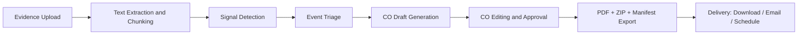
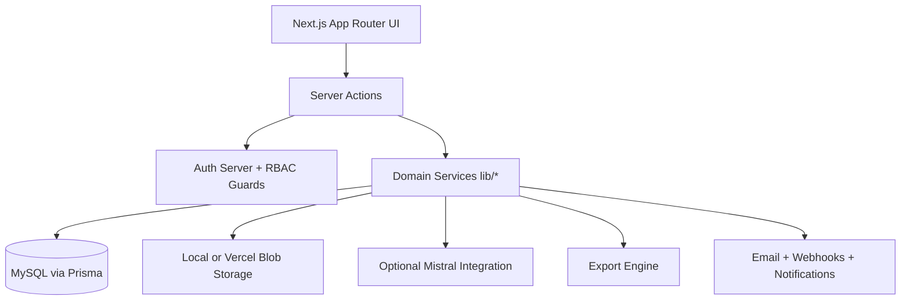
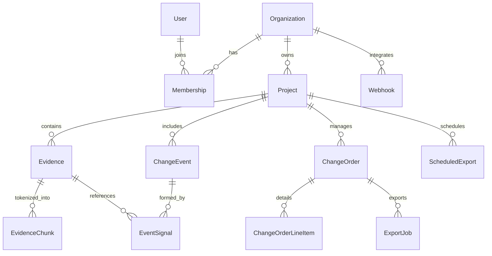
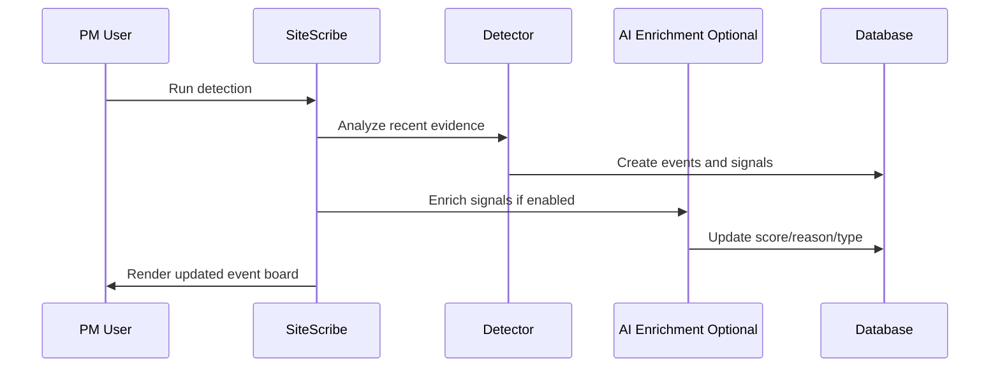
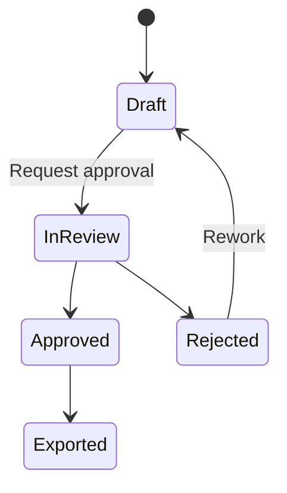
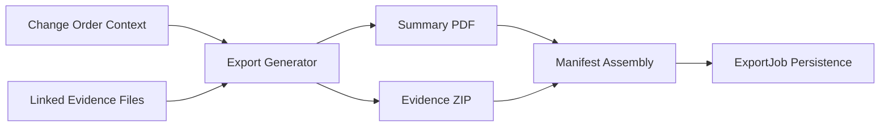
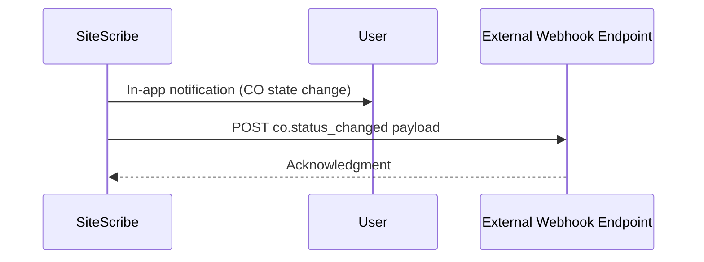
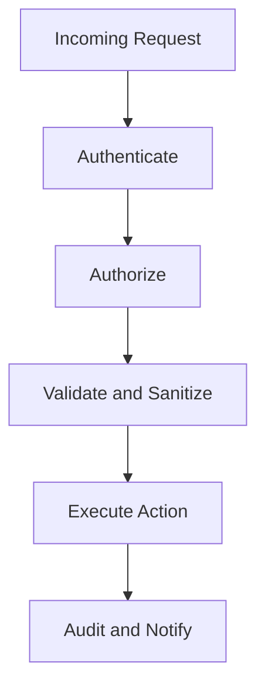

# SiteScribe: Engineering an Evidence-Centric Change Order Intelligence Platform for Construction

## Executive Summary

Construction teams often have the evidence they need, but not the operational system to convert that evidence into defensible Change Orders quickly and consistently.  

**SiteScribe** is designed to close this execution gap by unifying:
- evidence ingestion,
- signal detection,
- event triage,
- Change Order drafting/editing,
- audit logging,
- and export-grade packaging

inside one secure, multi-tenant platform.

This article presents a full A-Z technical and product analysis of SiteScribe, including architecture, domain model, security controls, AI augmentation strategy, delivery pipeline, and deployment posture.

---

## Founder and Mentor Acknowledgment

**Founder and Lead Developer**  
**Muhammed Murat Yanasoglu (AI Engineer)**  
https://muratyanasoglu.com/  
https://github.com/

**Mentorship and Technical Guidance**  
**PhD. Sergazy Nurbavliyev (Senior AI Engineer at Adobe)**  
LinkedIn: https://www.linkedin.com/in/sergazy/  
Medium: https://medium.com/@sernur213

---

## 1) Why This Problem Matters

In construction operations, evidence exists in fragmented and heterogeneous forms:
- site logs,
- RFIs,
- plan revisions,
- contracts,
- photo records.

Yet contractual outcomes (Change Orders) are often managed in separate channels. This creates:
- weak traceability,
- delayed approvals,
- elevated dispute risk,
- and avoidable financial leakage.

SiteScribe is built on one principle:

**Evidence should not be archival noise; it should be a first-class computational asset in CO decisioning.**

---

## 2) Product Thesis and Design Goals

### Product thesis
If evidence is normalized, linked, and continuously interpreted, CO workflows become faster, auditable, and operationally safer.

### Design goals
1. Evidence-to-output traceability by design.
2. Multi-tenant governance with strict RBAC.
3. Optional AI augmentation without functional lock-in.
4. Export integrity and audit readiness.
5. Practical field usability for real project teams.

---

## 3) One-Minute Product Flow

**Figure 1** (Insert screenshot: project workflow pages from Evidence to Exports)

---

## 4) Quick Start for New Users (Adoption Layer)

For teams evaluating SiteScribe, the minimum adoption path is:

1. Create organization and project.
2. Upload 3-5 realistic evidence items (log + RFI + plan revision recommended).
3. Run signal detection.
4. Open an event and generate a CO draft.
5. Edit line items and narrative.
6. Export the package and review manifest traceability.

This six-step loop demonstrates practical value without requiring full process migration on day one.

---

## 5) System Architecture

SiteScribe uses a layered full-stack architecture:

### Technology stack
- Next.js 14 (App Router)
- TypeScript
- Prisma ORM
- MySQL
- NextAuth (credentials)
- Mistral APIs (chat/embedding/vision, optional)
- pdf-lib + JSZip + SHA-256 export integrity

**Figure 2** (Insert screenshot: repository architecture or folder map)

---

## 6) Domain Model and Data Semantics

The platform is organization-first and project-scoped.

### High-value entities
- `Evidence`: canonical evidence object with content/hash/metadata.
- `ChangeEvent`: triage unit for clustered change signals.
- `ChangeOrder`: contractual output artifact.
- `ExportJob`: export lifecycle record.
- `AuditLog`: accountability source of truth for key entity changes.

---

## 7) Access Control and Multi-Tenancy

Security and governance are implemented through layered server-side checks:

1. Session identity (authenticated user).
2. Organization membership validation.
3. Role minimum enforcement.
4. Project-level scope validation.

Role hierarchy:
- VIEWER < SUBCONTRACTOR < FIELD < PM < OWNER

Examples:
- Evidence upload: FIELD+
- Signal triage and CO edits: PM+
- Webhook management: OWNER

This model enforces tenant isolation and least-privilege workflows.

---

## 8) Evidence Pipeline in Detail

### 8.1 Ingestion
- Accepts PDF/image uploads and structured site-log text.
- Validates MIME and size limits.
- Computes SHA-256 for file integrity.
- Stores metadata and ownership context.

### 8.2 Extraction and chunking
- PDF text extraction when available.
- Overlapping chunk generation for retrieval and AI operations.
- Chunk persistence as separate records.

### 8.3 Evidence linking and comparison
- Explicit evidence relationships via `EvidenceLink`.
- Plan revision compare workflow for side-by-side inspection.

**Figure 3** (Insert screenshot: evidence upload form and evidence list)  
**Figure 4** (Insert screenshot: evidence links page)  
**Figure 5** (Insert screenshot: plan revision compare page)

---

## 9) Signal Detection and Event Triage

Signal detection uses deterministic heuristics with optional AI enrichment.

### Heuristic baseline
- Evidence-type priors (e.g., plan revision, RFI)
- Keyword triggers
- Delay and cost pattern signals

### Event formation
- Signals grouped into triageable events
- Event state management supports workflow progression

### AI enrichment (optional)
- Signal score refinement
- Reason summarization
- Signal type classification (delay, cost, scope_change, risk, etc.)

**Figure 6** (Insert screenshot: signals page after detection)

---

## 10) Change Order Generation and Lifecycle

CO drafting starts from event context and supports:
- template-driven generation,
- optional AI-assisted narrative enrichment.

### Draft structure
- Scope narrative
- Contract clauses
- Assumptions and exclusions
- Schedule impact
- Cost estimate note
- Suggested line items

### Lifecycle controls
- Editor-based structured updates
- Comment threads
- Approval requests and decisions
- Audit logging for create/update/status transitions

**Figure 7** (Insert screenshot: event detail with Generate CO action)  
**Figure 8** (Insert screenshot: CO editor with line items, status, comments)

---

## 11) Search and Retrieval Strategy

SiteScribe supports dual retrieval modes:

1. Full-text retrieval
- Evidence fields: title, description, extracted text
- CO fields: title, scope narrative, clauses

2. Semantic retrieval (AI optional)
- Embedding-based evidence similarity
- Ranked hits with relevance scoring and snippets

This hybrid approach supports both lexical precision and intent-level discovery.

**Figure 9** (Insert screenshot: project search page with semantic and full-text sections)

---

## 12) Export Integrity and Delivery

Each export produces:
- summary PDF,
- ZIP package,
- `manifest.json` with file-level integrity metadata.

Manifest fields include:
- evidence IDs,
- filenames,
- SHA-256 hashes,
- MIME types,
- file sizes,
- export metadata.

Delivery channels:
- download links,
- email attachment delivery,
- scheduled exports via secured cron endpoint.

**Figure 10** (Insert screenshot: exports page)  
**Figure 11** (Insert screenshot: scheduled exports page)

---

## 13) Notifications, Webhooks, and Team Collaboration

### Notifications
- In-app notification feed for invites, comments, signal updates, and chat messages.

### Webhooks
- Outbound event push (`co.created`, `co.status_changed`)
- Optional signature support for endpoint verification.

### Team collaboration extensions
- Friend graph and request management.
- 1:1 chat between accepted users.

**Figure 12** (Insert screenshot: notifications page)  
**Figure 13** (Insert screenshot: webhooks management page)  
**Figure 14** (Insert screenshot: friends and chat pages)

---

## 14) Security Model

SiteScribe applies defense-in-depth:

1. Authentication and session control
- Credential auth with bcrypt hashing
- Production secret requirements
- Secure cookie/session strategy

2. Abuse resistance
- Rate limiting for auth/registration vectors
- Login failure tracking windows

3. Authorization enforcement
- Organization and project scope guards
- RBAC minimum role checks

4. Validation and sanitization
- Input length/format validation
- ID format guardrails
- Internal-link sanitation for notifications

5. Transport/browser controls
- Security headers including CSP
- HSTS in production

6. Scheduled job hardening
- Timing-safe comparison for cron secret validation

---

## 15) Localization and UX Readiness

The product supports:
- locale-driven UI (EN/TR/ES/FR),
- responsive layouts,
- theme toggles,
- route-level consistency for core operational pages.

This is essential for distributed teams with mixed language contexts.

**Figure 15** (Insert screenshot: localized interface with language switcher)

---

## 16) Deployment and Operational Controls

Supported operation modes:
- local development stack,
- cloud deployment with blob storage,
- self-hosted setups with controlled environment variables.

Key runtime toggles:
- AI enablement,
- storage provider selection,
- email delivery enablement,
- cron secret management.

This architecture allows staged rollout and environment-specific governance.

---

## 17) Testing and Quality Strategy

Current automated checks cover:
- RBAC behavior,
- signal scoring logic,
- export manifest/hash constraints,
- chat and ID validation rules.

Recommended next-stage quality expansion:
1. End-to-end integration tests for complete project flow.
2. Export integrity stress cases.
3. Access-boundary regression suites.
4. Observability metrics and failure budget tracking.

---

## 18) Practical Impact Scenario

### Before
- Evidence scattered across tools.
- Slow CO preparation.
- Weak traceability during review.

### With SiteScribe
- Evidence centralized and linkable.
- Event-to-CO conversion accelerated.
- Export package includes integrity metadata.
- Review and approval process becomes auditable.

This is the primary user value proposition: **faster, safer, and more defensible change workflows**.

---

## 19) Known Limitations and Future Work

High-priority evolution tracks:

1. Cron semantics
- Expand from simple run checks to strict expression-aware scheduling behavior.

2. Detection normalization
- Improve temporal grouping and classification precision.

3. Compliance intelligence
- Add richer contract-policy alignment analysis.

4. Retrieval quality benchmarking
- Formal semantic retrieval evaluation datasets.

5. Observability maturity
- Structured telemetry and incident-ready operational dashboards.

---

## 20) Final Remarks

SiteScribe demonstrates a practical path from unstructured construction evidence to traceable contractual outputs, with engineering rigor across architecture, governance, and export integrity.

For teams building in construction-tech, workflow systems, and applied AI, the key takeaway is clear:

**when evidence is treated as the center of the system, downstream operational reliability improves dramatically.**

---

## Call to Action

If you want to:
- evaluate the workflow for your team,
- review architecture decisions,
- or collaborate on advanced roadmap items,

reach out directly.

---

## Publication Image Checklist

1. (Insert screenshot: landing page value proposition)  
2. (Insert screenshot: project architecture/repo structure)  
3. (Insert screenshot: evidence upload and evidence list)  
4. (Insert screenshot: evidence links page)  
5. (Insert screenshot: plan compare page)  
6. (Insert screenshot: signals/events board)  
7. (Insert screenshot: event detail with CO generation)  
8. (Insert screenshot: CO editor with line items and comments)  
9. (Insert screenshot: search page with semantic results)  
10. (Insert screenshot: exports page)  
11. (Insert screenshot: scheduled exports page)  
12. (Insert screenshot: notifications page)  
13. (Insert screenshot: webhook page)  
14. (Insert screenshot: friends and chat pages)  
15. (Insert screenshot: language switcher/localized UI)
